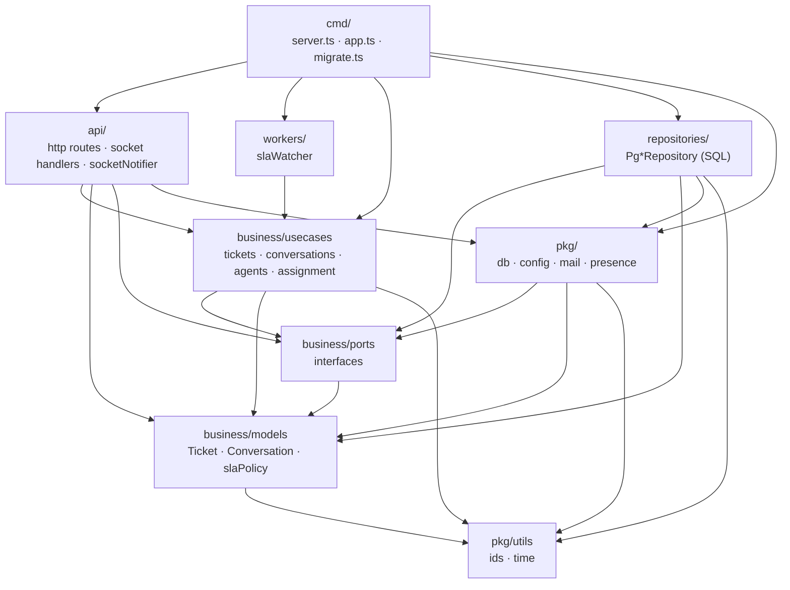

# Customer Support Chat System

ระบบบริการลูกค้าแบบ real-time เขียนด้วย **TypeScript** แบ่งโค้ดเป็น layer และเก็บข้อมูลใน **PostgreSQL**

- ลูกค้าแจ้งปัญหาผ่าน Web / Mobile / Email / Chat → ระบบสร้าง Ticket → auto-assign ให้ Agent
- Agent ตอบแชท, เปลี่ยนสถานะ, assign, escalate · SLA เตือนและ escalate อัตโนมัติ
- สถานะข้อความ sent / delivered / read · ส่งหาคนที่ offline ได้ · Team chat แบบ 1:1 และ Group

## วิธีรัน

ต้องมี **Node.js 20+** และ **Docker Desktop**

```bash
npm install
cp .env.example .env        # Windows PowerShell: copy .env.example .env
npm run db:up               # เปิด PostgreSQL ใน Docker
npm run dev                 # สร้างตารางอัตโนมัติ แล้วเปิดเซิร์ฟเวอร์ที่ http://localhost:3000
```

- หน้าลูกค้า: http://localhost:3000/
- Agent Dashboard: http://localhost:3000/agent.html

ทดสอบ SLA / escalate แบบเร็ว: ตั้ง `SLA_DEMO=1` ใน `.env` (นาที → วินาที)

| คำสั่ง | ใช้ทำอะไร |
|---|---|
| `npm run dev` | รันแบบพัฒนา (แก้โค้ดแล้วรีสตาร์ตเอง) |
| `npm run build` / `npm start` | build เป็น JavaScript แล้วรันแบบ production |
| `npm run db:up` / `npm run db:down` | เปิด / ปิด PostgreSQL ใน Docker |
| `npm run db:migrate` | สร้าง / อัปเดตตารางโดยไม่เปิดเซิร์ฟเวอร์ |
| `npm test` | รัน test ทั้งหมด (ใช้ PostgreSQL in-memory ไม่ต้องเปิด Docker) |
| `npm run lint:layers` | ตรวจว่าไม่มีการ import ย้อน layer |
| `npm run typecheck` | ตรวจ type |

## ดูข้อมูลด้วย TablePlus

Create a new connection → **PostgreSQL** แล้วใส่ค่าตาม `docker-compose.yml`:

| ช่อง | ค่า |
|---|---|
| Host | `localhost` |
| Port | `5433` |
| User | `support` |
| Password | `support` |
| Database | `support_chat` |

ตารางที่จะเห็น: `agents`, `customers`, `tickets`, `ticket_messages`, `ticket_events`, `conversations`, `conversation_members`, `conversation_messages`, `message_receipts`, `schema_migrations`

ตัวอย่าง SQL สำหรับตอบ Business questions (วางใน TablePlus ได้เลย):

```sql
-- ข้อความต่อวัน
SELECT created_at::date AS day, COUNT(*) FROM ticket_messages WHERE NOT internal GROUP BY 1 ORDER BY 1;

-- delivery latency / เวลาก่อนอ่าน เฉลี่ย (วินาที)
SELECT AVG(EXTRACT(EPOCH FROM delivered_at - created_at)) AS delivery_sec,
       AVG(EXTRACT(EPOCH FROM read_at - created_at))      AS read_sec
FROM ticket_messages WHERE NOT internal;

-- ticket ที่ผิด SLA
SELECT t.number, t.priority, t.status, e.created_at AS breached_at
FROM ticket_events e JOIN tickets t ON t.id = e.ticket_id
WHERE e.type = 'sla_breached' ORDER BY e.created_at DESC;

-- งานค้างของแต่ละ agent
SELECT a.name, COUNT(t.id) AS open_tickets
FROM agents a LEFT JOIN tickets t ON t.assignee_id = a.id AND t.status NOT IN ('resolved', 'closed')
GROUP BY a.name ORDER BY open_tickets DESC;
```

## สถาปัตยกรรม (Layered)



กฎ: import ได้เฉพาะทิศทางตามลูกศร ตรวจอัตโนมัติด้วย `npm run lint:layers` (และอยู่ใน `npm test`)

- **business/** ไม่รู้จัก express, socket.io หรือ pg เลย คุยกับโลกภายนอกผ่าน interface ใน `business/ports.ts`
- **repositories/** implement interface ของ repository ด้วย SQL — เปลี่ยนฐานข้อมูลได้โดยไม่แตะ usecases
- **api/socket/socketNotifier.ts** implement `Notifier` ด้วย Socket.IO — usecases แค่เรียก `notifier.ticketMessage(...)`
- **cmd/app.ts** เป็นจุดเดียวที่ประกอบทุก layer เข้าด้วยกัน (dependency injection)

```
src/
  cmd/            entry: server.ts, app.ts (composition root), migrate.ts
  api/http/       express app + routes (public, tickets, conversations, meta)
  api/socket/     socket handlers + socketNotifier
  workers/        slaWatcher (ตั้งเวลาอย่างเดียว logic อยู่ใน usecase checkSla)
  business/
    models/       types + กฎที่เป็น pure function (slaPolicy, bumpPriority, views)
    ports.ts      interfaces: repositories, Notifier, Mailer, Presence
    usecases/     ขั้นตอนทางธุรกิจ
  repositories/   PostgreSQL implementation
  pkg/            db (client + migrate), config, mail, presence, utils
migrations/       SQL schema (รันอัตโนมัติตอนเปิดเซิร์ฟเวอร์)
public/           หน้าเว็บลูกค้า + Agent Dashboard
tests/            unit + end-to-end + layer check
```

## SLA Policy (นาที) — `src/business/models/slaPolicy.ts`

| Priority | ตอบครั้งแรก | แก้ไขเสร็จ |
|---|---|---|
| urgent | 15 | 240 |
| high | 60 | 480 |
| normal | 240 | 1440 |
| low | 1440 | 4320 |

เหลือเวลา < 20% → เตือน · เกินเวลา → escalate ให้ Supervisor + เพิ่ม priority แล้วเริ่มนับ SLA รอบใหม่ · สถานะ `pending` หยุดนับ

## REST API

ฝั่ง agent ต้องส่ง header `x-agent-id` (เดโม — production เปลี่ยนเป็น JWT / Keycloak ที่ `requireAgent` ใน `src/api/http/helpers.ts`)

| Method | Path | ใช้ทำอะไร |
|---|---|---|
| POST | `/api/tickets` | ลูกค้าแจ้งปัญหา `{name,email,subject,message,priority,category,channel}` |
| POST | `/api/inbound/email` | Email webhook `{from,name,subject,body}` |
| GET | `/api/public/tickets/:id` | ลูกค้าดู ticket ของตัวเอง |
| POST | `/api/public/tickets/:id/messages` | ลูกค้าส่งข้อความ |
| GET | `/api/tickets?status=&assigneeId=&q=` | agent ดูรายการ ticket |
| GET | `/api/tickets/:id` | รายละเอียด (ใช้ id หรือ TK-xxxx) |
| POST | `/api/tickets/:id/messages` | agent ตอบ `{text, internal}` |
| PATCH | `/api/tickets/:id` | เปลี่ยน `status` / `priority` / `assigneeId` |
| POST | `/api/tickets/:id/escalate` | escalate `{reason}` |
| GET/POST | `/api/conversations` | รายการห้อง / สร้าง `{type:'direct'\|'group', name, memberIds}` |
| GET | `/api/conversations/:id/messages?before=&limit=` | ประวัติการสนทนา |
| POST | `/api/conversations/:id/messages` | ส่งข้อความ team chat |
| POST | `/api/conversations/:id/members` | `{add:[], remove:[]}` |
| GET | `/api/stats`, `/api/agents`, `/api/sla-policy` | ข้อมูลประกอบ |

## Socket.IO Events

| ทิศทาง | Event | ความหมาย |
|---|---|---|
| client → server | `agent:online` | agent เข้าระบบ (และรับข้อความที่ค้างตอน offline) |
| client → server | `ticket:join` | เข้าห้องแชทของ ticket |
| client → server | `message:ack` / `ticket:read` | แจ้งว่าได้รับ / อ่านแล้ว |
| client → server | `conv:ack` / `conv:read` / `conv:typing` | เหมือนกันสำหรับ team chat |
| server → client | `message:new`, `message:status` | ข้อความใหม่ / สถานะเปลี่ยน |
| server → client | `ticket:updated`, `ticket:status` | ticket เปลี่ยน (agent / ลูกค้า) |
| server → client | `conv:message`, `conv:status`, `conv:updated` | team chat |
| server → client | `notify`, `agents:presence`, `typing` | แจ้งเตือน / ใคร online / กำลังพิมพ์ |

## ต่อยอด

- Auth จริง (Keycloak / JWT) แทน `x-agent-id`
- Redis adapter ของ Socket.IO + ย้าย `MemoryPresence` ไป Redis เพื่อรันหลาย instance
- ส่งอีเมลจริง: เขียน `Mailer` ใหม่ใน `src/pkg/mail/` แล้วเปลี่ยนที่ `cmd/app.ts`
- ใช้ transaction ครอบขั้นตอนที่เขียนหลายตาราง (เช่น `openTicket`)
