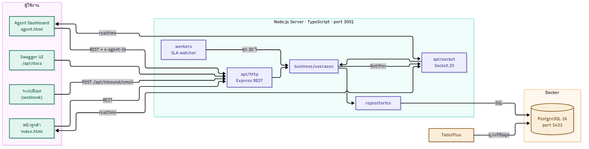
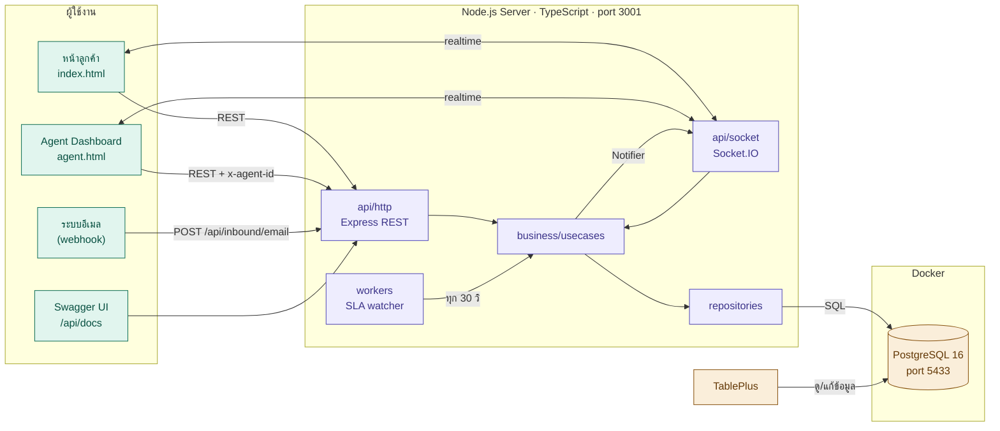
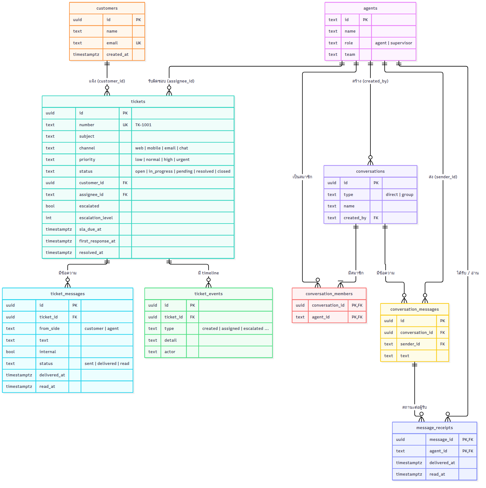
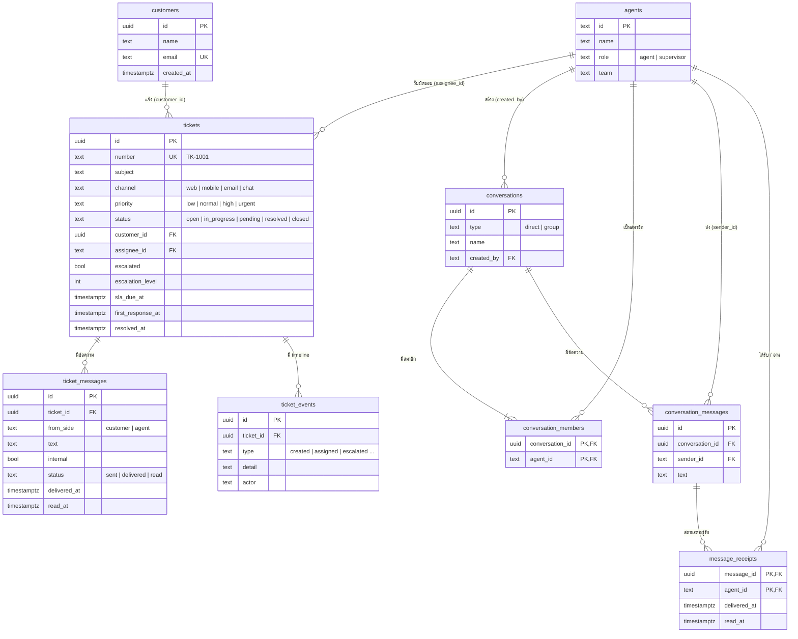

# Architecture

## 1. ภาพรวมระบบ (System architecture)

```mermaid
flowchart LR
  subgraph Clients["ผู้ใช้งาน"]
    cust["หน้าลูกค้า<br/>index.html"]
    agent["Agent Dashboard<br/>agent.html"]
    mail["ระบบอีเมล<br/>(webhook)"]
    swagger["Swagger UI<br/>/api/docs"]
  end

  subgraph Server["Node.js Server · TypeScript · port 3001"]
    http["api/http<br/>Express REST"]
    socket["api/socket<br/>Socket.IO"]
    worker["workers<br/>SLA watcher"]
    uc["business/usecases"]
    repo["repositories"]
  end

  subgraph Docker["Docker"]
    db[("PostgreSQL 16<br/>port 5433")]
  end
  tp["TablePlus"]

  cust -- "REST" --> http
  cust <-- "realtime" --> socket
  agent -- "REST + x-agent-id" --> http
  agent <-- "realtime" --> socket
  mail -- "POST /api/inbound/email" --> http
  swagger --> http

  http --> uc
  socket --> uc
  worker -- "ทุก 30 วิ" --> uc
  uc -- "Notifier" --> socket
  uc --> repo
  repo -- "SQL" --> db
  tp -- "ดู/แก้ข้อมูล" --> db

  classDef client fill:#E1F5EE,stroke:#0F6E56,color:#085041
  classDef app fill:#EEEDFE,stroke:#534AB7,color:#3C3489
  classDef data fill:#FAEEDA,stroke:#854F0B,color:#633806
  class cust,agent,mail,swagger client
  class http,socket,worker,uc,repo app
  class db,tp data
```

## 2. โครงสร้างฐานข้อมูล (ER diagram)

```mermaid
erDiagram
  agents ||--o{ tickets : "รับผิดชอบ (assignee_id)"
  customers ||--o{ tickets : "แจ้ง (customer_id)"
  tickets ||--o{ ticket_messages : "มีข้อความ"
  tickets ||--o{ ticket_events : "มี timeline"
  agents ||--o{ conversations : "สร้าง (created_by)"
  conversations ||--|{ conversation_members : "มีสมาชิก"
  agents ||--o{ conversation_members : "เป็นสมาชิก"
  conversations ||--o{ conversation_messages : "มีข้อความ"
  agents ||--o{ conversation_messages : "ส่ง (sender_id)"
  conversation_messages ||--o{ message_receipts : "สถานะต่อผู้รับ"
  agents ||--o{ message_receipts : "ได้รับ / อ่าน"

  agents {
    text id PK
    text name
    text role "agent | supervisor"
    text team
  }
  customers {
    uuid id PK
    text name
    text email UK
    timestamptz created_at
  }
  tickets {
    uuid id PK
    text number UK "TK-1001"
    text subject
    text channel "web | mobile | email | chat"
    text priority "low | normal | high | urgent"
    text status "open | in_progress | pending | resolved | closed"
    uuid customer_id FK
    text assignee_id FK
    bool escalated
    int escalation_level
    timestamptz sla_due_at
    timestamptz first_response_at
    timestamptz resolved_at
  }
  ticket_messages {
    uuid id PK
    uuid ticket_id FK
    text from_side "customer | agent"
    text text
    bool internal
    text status "sent | delivered | read"
    timestamptz delivered_at
    timestamptz read_at
  }
  ticket_events {
    uuid id PK
    uuid ticket_id FK
    text type "created | assigned | escalated ..."
    text detail
    text actor
  }
  conversations {
    uuid id PK
    text type "direct | group"
    text name
    text created_by FK
  }
  conversation_members {
    uuid conversation_id PK,FK
    text agent_id PK,FK
  }
  conversation_messages {
    uuid id PK
    uuid conversation_id FK
    text sender_id FK
    text text
  }
  message_receipts {
    uuid message_id PK,FK
    text agent_id PK,FK
    timestamptz delivered_at
    timestamptz read_at
  }
```

โครงสร้าง layer ของโค้ด backend ดูที่ [backend-layers.md](backend-layers.md)
