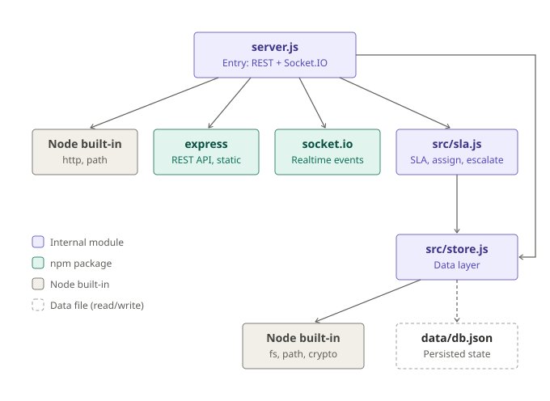
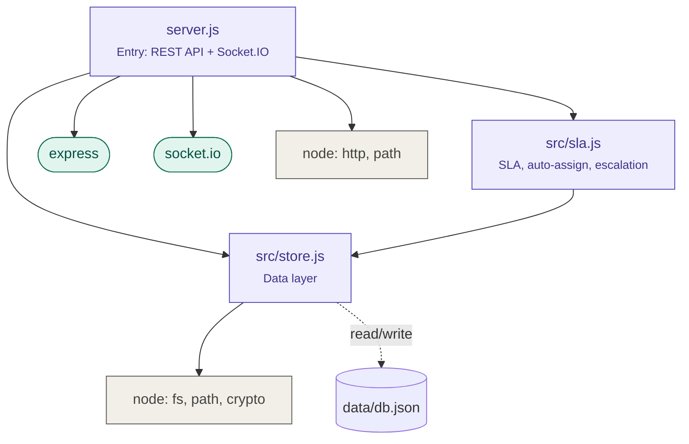

# Backend Package Dependency Diagram

โค้ด Mermaid (แก้ไขง่าย, GitHub แสดงเป็นรูปให้อัตโนมัติ):

| โมดูล | พึ่งพา | หน้าที่ |
|---|---|---|
| `server.js` | express, socket.io, http, path, `src/sla.js`, `src/store.js` | REST API, realtime events, business logic |
| `src/sla.js` | `src/store.js` | SLA policy, auto-assign, escalation, SLA watcher |
| `src/store.js` | fs, path, crypto | อ่าน/เขียน `data/db.json` |

ทิศทางการพึ่งพาเป็นทางเดียว (server → sla → store) ไม่มี circular dependency
และ `store.js` เป็นจุดเดียวที่แตะข้อมูล จึงเปลี่ยนเป็น PostgreSQL / MongoDB ได้โดยไม่ต้องแก้ไฟล์อื่น
