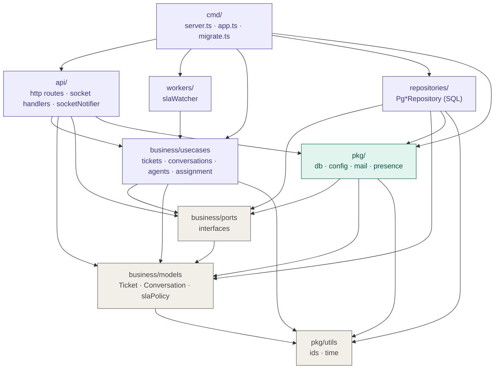

# Backend Layered Dependency Diagram

โครงสร้างหลัง refactor เป็น TypeScript + PostgreSQL (v2) — ลูกศร = "import ได้"

| Layer | โฟลเดอร์ | import ได้เฉพาะ |
|---|---|---|
| entry | `src/cmd/` | ทุก layer (ประกอบระบบ) |
| api | `src/api/` | usecases, models, ports, pkg |
| worker | `src/workers/` | usecases |
| usecases | `src/business/usecases/` | ports, models, pkg/utils — **ห้าม** express / socket.io / pg |
| repositories | `src/repositories/` | ports, models, pkg/db, pkg/utils |
| infra | `src/pkg/` | ports, models, pkg |
| models | `src/business/models/` | pkg/utils |

ต่างจากแผนภาพต้นแบบ: ไม่มี `repositories → usecases` — repository รู้จักแค่ interface ใน `business/ports.ts`
และมี `npm run lint:layers` ตรวจกฎนี้อัตโนมัติ (อยู่ใน `npm test` ด้วย)
