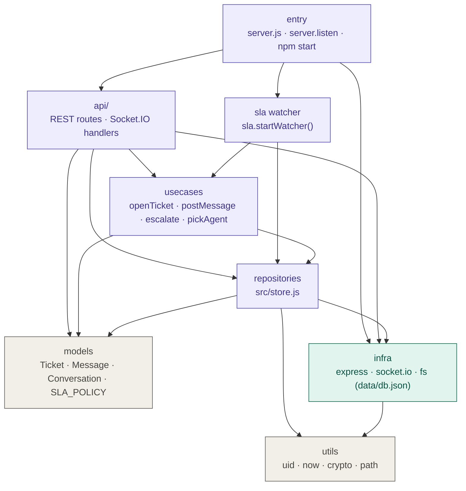

# Backend Layered Dependency Diagram

แผนภาพแบบ layer (entry → api → usecases → repositories → models / infra / utils) โดย map จากโค้ดจริง

| Layer | อยู่ในไฟล์ | สิ่งที่อยู่ข้างใน |
|---|---|---|
| entry | `server.js` (ท้ายไฟล์) | `server.listen`, เรียก `sla.startWatcher` |
| api/ | `server.js` | `app.get/post/patch(...)`, `io.on('connection')` |
| sla watcher | `src/sla.js` | `startWatcher()` ตรวจ SLA ทุก 30 วินาที |
| usecases | `server.js`, `src/sla.js` | `openTicket`, `postMessage`, `escalate`, `pickAgent`, `computeDue` |
| repositories | `src/store.js` | `createTicket`, `addMessage`, `markConv`, `stats` ฯลฯ |
| models | `src/store.js`, `src/sla.js` | โครงสร้าง Ticket / Message / Conversation, `SLA_POLICY` |
| infra | npm + Node | `express`, `socket.io`, `fs` → `data/db.json` |
| utils | `src/store.js` | `uid()`, `now()`, `crypto`, `path` |

ทิศทางการพึ่งพาเป็นทางเดียวจากบนลงล่าง ไม่มี repositories ย้อนกลับไปเรียก usecases
